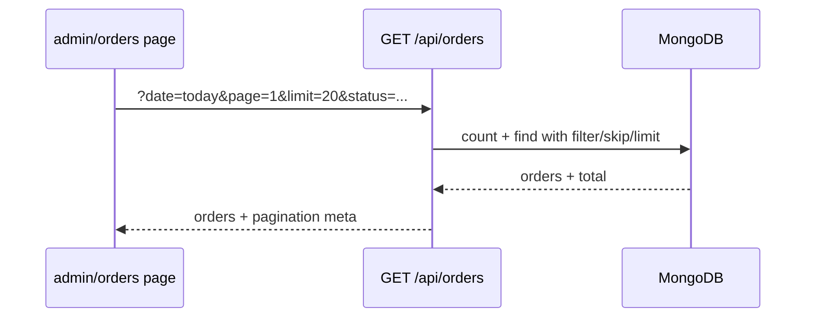

# Admin orders: pagination + Today's filter (default)

## Current state

- [`app/admin/orders/page.tsx`](app/admin/orders/page.tsx) fetches **all** orders via `GET /api/orders` (auth), filters **client-side** (status, payment, lunch), polls every 10s.
- [`api-server/controllers/orderController.js`](api-server/controllers/orderController.js) `getOrders` returns a plain array; supports `status` and `type` query params only.
- [`app/admin/page.tsx`](app/admin/page.tsx) dashboard uses the same endpoint and expects an **array** — must stay backward-compatible.

## Architecture



**Paginated mode** (admin orders only): when `req.user` and `page` query param are present.

**Legacy mode** (unchanged): no `page` param → return array (dashboard, `/orders/active`).

## API changes (`api-server` submodule)

File: [`api-server/controllers/orderController.js`](api-server/controllers/orderController.js)

### 1. Today range helper (VN timezone)

Reuse the project convention `Asia/Ho_Chi_Minh` (same as [`orderController.js`](api-server/controllers/orderController.js) `getNextAvailableDate`):

```js
function getTodayRangeVN() {
  const now = new Date(new Date().toLocaleString('en-US', { timeZone: 'Asia/Ho_Chi_Minh' }));
  const start = new Date(now);
  start.setHours(0, 0, 0, 0);
  const end = new Date(now);
  end.setHours(23, 59, 59, 999);
  return { start, end };
}
```

### 2. Extend `getOrders` query params (paginated branch)

| Param | Values | Notes |
|-------|--------|-------|
| `page` | number, default `1` | Triggers paginated response when present + authenticated |
| `limit` | number, default `20`, max `50` | Page size |
| `date` | `today` \| omit | `today` adds `createdAt` range; omit = all time |
| `status` | existing comma-list or single | e.g. `pending` |
| `paymentStatus` | `paid` \| `unpaid` | New; omit = all |
| `type` | `lunch` | Existing; maps to lunch-only toggle |

Build Mongo `filter`, then:

```js
const total = await Order.countDocuments(filter);
const orders = await Order.find(filter)
  .sort({ createdAt: -1 })
  .skip((page - 1) * limit)
  .limit(limit);

res.json({
  orders,
  pagination: {
    page,
    limit,
    total,
    totalPages: Math.max(1, Math.ceil(total / limit)),
  },
});
```

### 3. Backward compatibility

- `GET /orders/active` — no `page` → array + anonymous masking (unchanged).
- `GET /orders` (admin, no `page`) — array (dashboard [`app/admin/page.tsx`](app/admin/page.tsx) unchanged).
- `GET /orders?page=1&date=today&...` — paginated object.

No route file changes required ([`orderRoutes.js`](api-server/routes/orderRoutes.js) already uses `getOrders`).

## Frontend changes

File: [`app/admin/orders/page.tsx`](app/admin/orders/page.tsx)

### State (defaults)

```ts
filterDate: 'today' | 'all'  // default 'today'
page: 1
pagination: { total, totalPages, limit } | null
```

Keep existing `filterStatus`, `filterPayment`, `lunchOnly` — but **send them as query params** instead of client `.filter()`.

### Fetch

Build query string from filters + `page`:

```
/api/orders?page=${page}&limit=20&date=today
  &status=pending          // if not 'all'
  &paymentStatus=unpaid    // if not 'all'
  &type=lunch              // if lunchOnly
```

Parse response `{ orders, pagination }`; store both.

- Reset `page` to `1` when any filter changes (`filterDate`, status, payment, lunch).
- `useEffect` deps: `[token, filterDate, filterStatus, filterPayment, lunchOnly, page]` for fetch + 10s poll.

### UI

1. **Date quick filter** (new, placed before status pills):
   - **Today** (default, active styling) — `filterDate = 'today'`
   - **All time** — `filterDate = 'all'`
   - Use `Calendar` / `History` icons to match existing toolbar patterns.

2. **Pagination bar** (below order list):
   - Prev / Next buttons (disabled at bounds)
   - Text: `Showing {(page-1)*limit+1}–{min(page*limit, total)} of {total}` or `Page X of Y`
   - Optional: show empty state when `total === 0` with filter-aware message

3. **Remove** client-side `filteredOrders` — list renders `orders` from API directly.

### Optional helper

Add `buildOrdersQuery(params)` in [`lib/api.ts`](lib/api.ts) to keep query construction in one place (admin-only, small helper).

## Files to touch

| File | Change |
|------|--------|
| [`api-server/controllers/orderController.js`](api-server/controllers/orderController.js) | Today range helper, paginated branch, `paymentStatus` filter |
| [`app/admin/orders/page.tsx`](app/admin/orders/page.tsx) | Date filter UI, server fetch, pagination UI |
| [`lib/api.ts`](lib/api.ts) | Optional query builder + response type |

**Not changed:** [`app/admin/page.tsx`](app/admin/page.tsx), storefront `/orders/active`, public routes.

## Testing checklist

1. Open `/admin/orders` → **Today** selected by default; only today's orders (VN day boundary).
2. Switch to **All time** → older orders appear; pagination recalculates.
3. Combine Today + Unpaid + Preparing → correct subset; page resets to 1 on filter change.
4. Prev/Next across pages; disabled states on first/last page.
5. Create new order today → appears after poll (may need page 1 if sorted by `createdAt` desc).
6. Dashboard `/admin` still loads and shows stats (array response unchanged).
7. Storefront Orders `/orders/active` still works.

## Submodule note

`api-server` is a git submodule — commit API changes in that repo if your workflow splits submodule vs parent.
