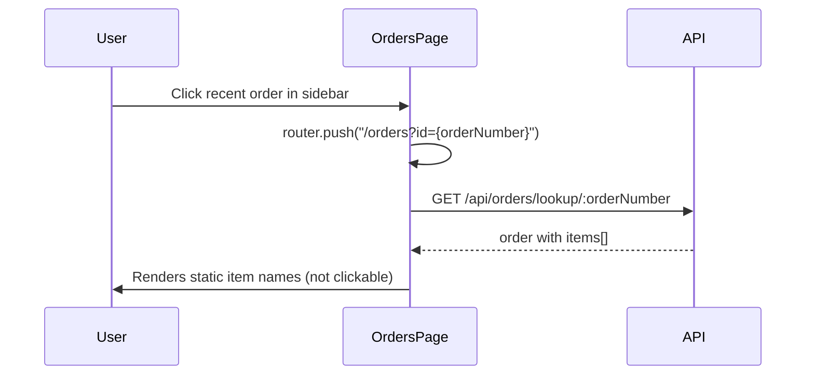
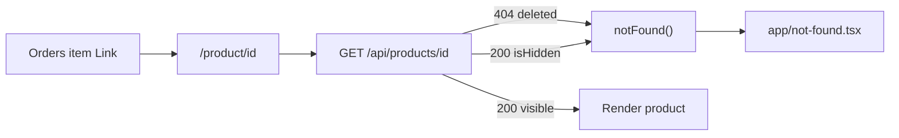

# Clickable order items on Orders tab

## Context

The **Orders** nav tab ([`components/StorefrontNav.tsx`](components/StorefrontNav.tsx)) points to [`/orders`](app/(storefront)/orders/page.tsx). Flow today:



Menu product pages use **`/product/${product._id}`** (see [`app/(storefront)/menu/page.tsx`](app/(storefront)/menu/page.tsx) line 23). Coffee orders already persist `product` on each line item when placed ([`app/(storefront)/product/[id]/page.tsx`](app/(storefront)/product/[id]/page.tsx) ~185, schema in [`api-server/models/Order.js`](api-server/models/Order.js)).

## Target UI

In the order detail panel (“Brewed Items”), when an item has a `product` id:

- Wrap the item name row (or the whole left column) in Next.js `<Link href={`/product/${id}`}>`
- Add hover styles (`hover:text-primary`, `hover:underline`, `cursor-pointer`) consistent with other storefront links

When **no** `product` id (lunch orders: name-only line items from [`lunchController.js`](api-server/controllers/lunchController.js)):

- Keep plain text (no broken links)

When the linked product is **deleted or hidden**:

- Navigating to `/product/[id]` must show a **real 404** (Next.js `notFound()`), not a 200 page with inline “Product not found”

## Implementation

### 1. Helper for product id extraction

Add to [`lib/api.ts`](lib/api.ts):

```typescript
export function getOrderItemProductId(item: { product?: string | { _id?: string } }): string | null {
  if (!item?.product) return null;
  if (typeof item.product === 'string') return item.product;
  if (typeof item.product === 'object' && item.product._id) return String(item.product._id);
  return null;
}
```

### 2. Update Orders detail item list

File: [`app/(storefront)/orders/page.tsx`](app/(storefront)/orders/page.tsx) (~lines 267–281)

- Import `getOrderItemProductId` from `@/lib/api`
- If `productId` exists: wrap item name in `<Link href={`/product/${productId}`}>` with hover styles
- Else: unchanged static markup
- **Still link** even when product may be gone — destination handles 404 (no pre-fetch on Orders page)

### 3. Proper 404 for deleted / hidden products

**Current behavior** ([`app/(storefront)/product/[id]/page.tsx`](app/(storefront)/product/[id]/page.tsx)):

- **Hidden**: API returns product with `isHidden: true`; page sets `product = null` and renders inline “Product not found” (HTTP 200)
- **Deleted**: `fetchAPI` throws on API 404; catch only logs; same inline UI (HTTP 200)

**Required behavior:**

| Case | API response | Product page action |
|------|----------------|---------------------|
| Deleted | `GET /api/products/:id` → 404 | `notFound()` |
| Hidden | 200 with `isHidden: true` | `notFound()` (treat as unavailable to customers, same as menu list filter) |

Changes in [`app/(storefront)/product/[id]/page.tsx`](app/(storefront)/product/[id]/page.tsx):

```typescript
import { notFound } from 'next/navigation';

// In getData():
const prodData = await fetchAPI(`${endpoints.products}/${id}`);
if (prodData.isHidden) {
  notFound();
}
// In catch (fetch failed / 404):
notFound();
```

Remove the inline `if (!product) { ... Product not found ... }` block — `notFound()` delegates to the not-found UI.

Add [`app/not-found.tsx`](app/not-found.tsx) (project has none today): branded 404 with title, short message, and link to `/menu`. Next.js App Router will return **404 status** for `notFound()` calls.



**No API changes** for this edge case: `getProductById` already returns 404 for deleted products; hidden products are intentionally returned so the **frontend** enforces customer-facing 404 (consistent with existing `isHidden` check).

### 4. No backend changes for orders

[`getOrderByNumber`](api-server/controllers/orderController.js) already returns `items[].product`. Order lookup unchanged.

## Price immutability (verified — no work needed for this feature)

**Does the logic exist?** Yes, via **snapshot fields** on the order document — not via a dedicated “freeze price” service.

| Layer | Behavior |
|-------|----------|
| **Schema** ([`api-server/models/Order.js`](api-server/models/Order.js)) | Each line item stores `price`, `subtotal`, `name`, and `variantOptions` (with `priceModifier`) at order time |
| **Create order** ([`orderController.js`](api-server/controllers/orderController.js) `createOrder`) | Persists `items` and `total` from the request body; validates stock/product existence only — **does not** overwrite prices from current `Product.price` |
| **Storefront checkout** ([`product/[id]/page.tsx`](app/(storefront)/product/[id]/page.tsx)) | Computes `itemPrice` / `subtotal` from catalog at checkout and sends them in the POST body |
| **Display** ([`orders/page.tsx`](app/(storefront)/orders/page.tsx), [`order/page.tsx`](app/(storefront)/order/page.tsx)) | Renders `item.subtotal` from the order — **never** re-fetches live `product.price` for historical orders |
| **Product link** (planned) | Navigating to `/product/[id]` shows **current** menu price; order detail still shows the **stored** `subtotal` — correct separation |

**Caveats (existing, not introduced by this task):**

- No **server-side** recomputation or validation that `item.price` matches catalog at create time (client-trusted snapshot; tampering possible).
- **Admin “Edit Items”** ([`OrderModal.tsx`](components/OrderModal.tsx)) intentionally sets `item.price` from the **current** product when the admin changes the selected product — that updates the order snapshot, not a live join.
- Changing menu price later does **not** retroactively change saved orders.

No changes required for clickable order items unless you later want server-side price verification at checkout.

## Out of scope

| Area | Reason |
|------|--------|
| Admin orders page | Not the Orders tab |
| `/order` post-checkout page | Optional follow-up |
| Lunch items → product links | No product ids on lunch line items |
| Pre-validating links on Orders page | Extra API calls; 404 on destination is sufficient |
| Server-side price freeze enforcement | Already snapshot-based; optional hardening is a separate task |

## Testing checklist

1. Coffee order → Orders tab → item links to correct `/product/[id]`.
2. **Hidden product** (admin toggled hide) → click order item → **404 page** (not 200 with message).
3. **Deleted product** → click order item → **404 page**.
4. Lunch order → items remain plain text.
5. Legacy item without `product` → plain text, no crash.
6. Valid product link still renders product detail normally.
