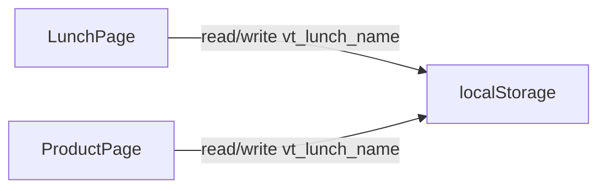

# Prefill customer name on coffee product page

## Current behavior

| Page | Storage key | Load on mount | Save while typing |
|------|-------------|---------------|-------------------|
| [`app/(storefront)/lunch/page.tsx`](app/(storefront)/lunch/page.tsx) | `vt_lunch_name` | Yes (lines 82–86) | Yes (lines 89–94) |
| [`app/(storefront)/product/[id]/page.tsx`](app/(storefront)/product/[id]/page.tsx) | — | No (`customerName` starts `''`) | No |
| Product page only | `anonymous_order` | Yes | Yes |

Lunch pattern to replicate:

```63:94:app/(storefront)/lunch/page.tsx
const LUNCH_NAME_KEY = 'vt_lunch_name';
// mount: getItem → setName
// on name change: setItem when trim() non-empty
```

Product name input today (no persistence):

```351:357:app/(storefront)/product/[id]/page.tsx
<input
  value={customerName}
  onChange={(e) => setCustomerName(e.target.value)}
/>
```

## Recommended approach

Use the **same** `localStorage` key as lunch so one remembered name works across lunch and coffee orders (expected UX for “remember my name”).



No API or backend changes.

## Implementation

### 1. Shared storage key (optional but avoids drift)

Add to [`lib/utils.ts`](lib/utils.ts):

```ts
export const CUSTOMER_NAME_STORAGE_KEY = 'vt_lunch_name';
```

Update [`app/(storefront)/lunch/page.tsx`](app/(storefront)/lunch/page.tsx) to import `CUSTOMER_NAME_STORAGE_KEY` instead of local `LUNCH_NAME_KEY` (same string value — existing saved names keep working).

### 2. Product page [`app/(storefront)/product/[id]/page.tsx`](app/(storefront)/product/[id]/page.tsx)

**Load on mount** (alongside existing `anonymous_order` load in the `useEffect` that depends on `[id]`):

```ts
const savedName = localStorage.getItem(CUSTOMER_NAME_STORAGE_KEY);
if (savedName) setCustomerName(savedName);
```

**Persist while typing** (new `useEffect` on `[customerName]`, same as lunch):

```ts
if (customerName.trim()) {
  localStorage.setItem(CUSTOMER_NAME_STORAGE_KEY, customerName.trim());
}
```

**Do not** clear storage when “Order anonymously” is checked — staff still receives `customerName` on submit; lunch has no anonymous toggle and always persists the typed name.

**Out of scope:** review form `newReview.customerName` (separate field, not part of checkout).

### 3. Files touched

| File | Change |
|------|--------|
| [`lib/utils.ts`](lib/utils.ts) | Export `CUSTOMER_NAME_STORAGE_KEY` |
| [`app/(storefront)/lunch/page.tsx`](app/(storefront)/lunch/page.tsx) | Use shared constant |
| [`app/(storefront)/product/[id]/page.tsx`](app/(storefront)/product/[id]/page.tsx) | Load + save customer name |

## Testing checklist

1. Enter name on lunch page → open `/product/[id]` → name field prefilled.
2. Enter name on product page → refresh or visit another product → name still prefilled.
3. Edit name on product page → return to lunch → updated name appears.
4. Anonymous toggle still works; order submit still requires non-empty name when not anonymous (existing validation unchanged).
